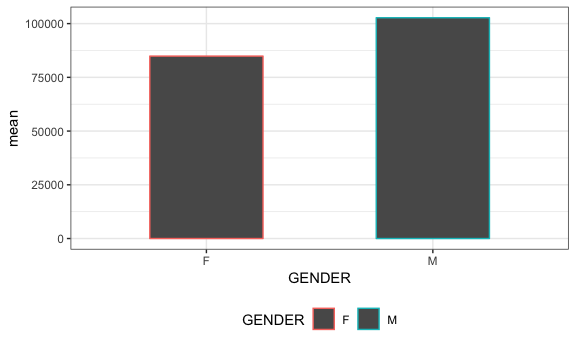
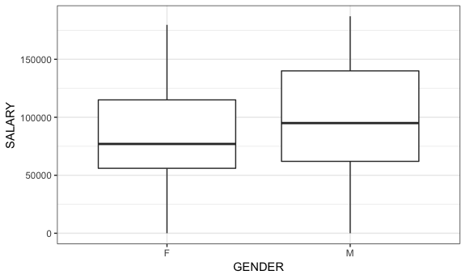
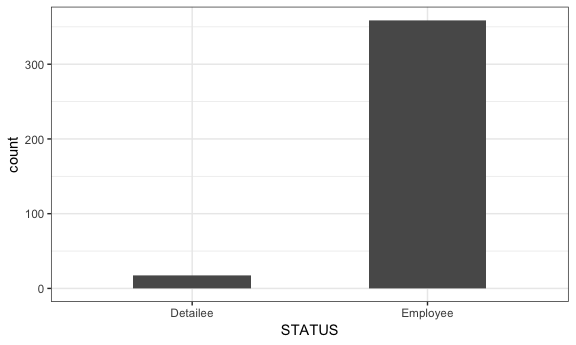

2017 White House Employee Salary Analysis
================
Amin Yakubu
10/6/2018

Loading tidyverse package and setting global options

``` r
library(tidyverse)
```

    ## ── Attaching packages ───────────────────────────────────────────────────────────────── tidyverse 1.2.1 ──

    ## ✔ ggplot2 3.0.0     ✔ purrr   0.2.5
    ## ✔ tibble  1.4.2     ✔ dplyr   0.7.6
    ## ✔ tidyr   0.8.1     ✔ stringr 1.3.1
    ## ✔ readr   1.1.1     ✔ forcats 0.3.0

    ## ── Conflicts ──────────────────────────────────────────────────────────────────── tidyverse_conflicts() ──
    ## ✖ dplyr::filter() masks stats::filter()
    ## ✖ dplyr::lag()    masks stats::lag()

``` r
knitr::opts_chunk$set(
  fig.width = 6,
  fig.asp = .6,
  out.width = "90%"
)

theme_set(theme_bw() + theme(legend.position = "bottom"))
```

``` r
library(tidyverse)
```

Reading and cleaning the dataset

``` r
wh_pay = read_csv("./data//white_house_2017_salaries_clean.csv") %>% 
  select(-(starts_with("X")))
```

    ## Warning: Missing column names filled in: 'X7' [7], 'X8' [8], 'X9' [9],
    ## 'X10' [10], 'X11' [11]

    ## Parsed with column specification:
    ## cols(
    ##   NAME = col_character(),
    ##   STATUS = col_character(),
    ##   SALARY = col_integer(),
    ##   `PAY BASIS` = col_character(),
    ##   TITLE = col_character(),
    ##   GENDER = col_character(),
    ##   X7 = col_character(),
    ##   X8 = col_character(),
    ##   X9 = col_character(),
    ##   X10 = col_character(),
    ##   X11 = col_character()
    ## )

In 2017, the White House spent a total of $ 0 on the salaries of 377 employees.

Below is a table showing the top 10 earners

``` r
wh_pay %>% 
  top_n(10, SALARY) %>% 
  arrange(desc(SALARY)) %>% 
  knitr::kable()
```

| NAME                    | STATUS   |  SALARY| PAY BASIS | TITLE                      | GENDER |
|:------------------------|:---------|-------:|:----------|:---------------------------|:-------|
| House, Mark S.          | Detailee |  187100| Per Annum | SENIOR POLICY ADVISOR      | M      |
| Priebus, Reinhold R.    | Employee |  179700| Per Annum | ASSISTANT TO THE PRESIDENT | M      |
| Reynolds, Lindsay B.    | Employee |  179700| Per Annum | ASSISTANT TO THE PRESIDENT | F      |
| Bannon, Stephen K.      | Employee |  179700| Per Annum | ASSISTANT TO THE PRESIDENT | M      |
| McGahn, II, Donald F.   | Employee |  179700| Per Annum | ASSISTANT TO THE PRESIDENT | M      |
| Dearborn, Ricky A.      | Employee |  179700| Per Annum | ASSISTANT TO THE PRESIDENT | M      |
| Hagin, Joseph W.        | Employee |  179700| Per Annum | ASSISTANT TO THE PRESIDENT | M      |
| McFarland, Kathleen T.  | Employee |  179700| Per Annum | ASSISTANT TO THE PRESIDENT | F      |
| Powell, Dina H.         | Employee |  179700| Per Annum | ASSISTANT TO THE PRESIDENT | F      |
| Manigault, Omarosa O.   | Employee |  179700| Per Annum | ASSISTANT TO THE PRESIDENT | F      |
| DeStefano, John J.      | Employee |  179700| Per Annum | ASSISTANT TO THE PRESIDENT | M      |
| Scavino, Daniel J.      | Employee |  179700| Per Annum | ASSISTANT TO THE PRESIDENT | M      |
| Hicks, Hope C.          | Employee |  179700| Per Annum | ASSISTANT TO THE PRESIDENT | F      |
| Bremberg, Andrew P.     | Employee |  179700| Per Annum | ASSISTANT TO THE PRESIDENT | M      |
| Short, Marc T.          | Employee |  179700| Per Annum | ASSISTANT TO THE PRESIDENT | M      |
| Sifakis, George A.      | Employee |  179700| Per Annum | ASSISTANT TO THE PRESIDENT | M      |
| Kellogg, Jr., Joseph K. | Employee |  179700| Per Annum | ASSISTANT TO THE PRESIDENT | M      |
| Spicer, Sean M.         | Employee |  179700| Per Annum | ASSISTANT TO THE PRESIDENT | M      |
| Miller, Stephen         | Employee |  179700| Per Annum | ASSISTANT TO THE PRESIDENT | M      |
| Conway, Kellyanne E.    | Employee |  179700| Per Annum | ASSISTANT TO THE PRESIDENT | F      |
| Greenblatt, Jason D.    | Employee |  179700| Per Annum | ASSISTANT TO THE PRESIDENT | M      |
| Porter, Robert R.       | Employee |  179700| Per Annum | ASSISTANT TO THE PRESIDENT | M      |
| Bossert, Thomas P.      | Employee |  179700| Per Annum | ASSISTANT TO THE PRESIDENT | M      |

``` r
wh_pay %>%
  group_by(GENDER) %>%
  summarize(n = n())
```

    ## # A tibble: 2 x 2
    ##   GENDER     n
    ##   <chr>  <int>
    ## 1 F        166
    ## 2 M        211

``` r
wh_pay %>% 
  group_by(TITLE) %>% 
  summarize(n = n()) %>% 
  arrange(desc(n))
```

    ## # A tibble: 68 x 2
    ##    TITLE                                  n
    ##    <chr>                              <int>
    ##  1 SPECIAL ASSISTANT TO THE PRESIDENT    77
    ##  2 DEPUTY ASSISTANT TO THE PRESIDENT     28
    ##  3 ASSISTANT TO THE PRESIDENT            26
    ##  4 DIRECTOR                              24
    ##  5 EXECUTIVE ASSISTANT                   20
    ##  6 ASSOCIATE DIRECTOR                    18
    ##  7 STAFF ASSISTANT                       18
    ##  8 ASSOCIATE COUNSEL TO THE PRESIDENT    13
    ##  9 INFORMATION SERVICES OPERATOR         12
    ## 10 DEPUTY DIRECTOR                       11
    ## # ... with 58 more rows

``` r
wh_pay %>% 
  group_by(GENDER) %>% 
  summarize(n = n(),
            mean = mean(SALARY),
            median = median(SALARY)) 
```

    ## # A tibble: 2 x 4
    ##   GENDER     n    mean median
    ##   <chr>  <int>   <dbl>  <dbl>
    ## 1 F        166  84886.  77000
    ## 2 M        211 102729.  95000

``` r
wh_pay %>%
  group_by(GENDER) %>%
  summarize(n = n(),
            mean = mean(SALARY),
            median = median(SALARY))  %>%
  ggplot(aes(x = GENDER, y = mean, color = GENDER)) + 
  geom_col(width = 0.5)
```



``` r
ggplot(wh_pay, aes(x = GENDER, y = SALARY)) +
  geom_boxplot()
```



``` r
ggplot(wh_pay, aes(x = STATUS)) + 
  geom_bar(width = 0.5)
```


